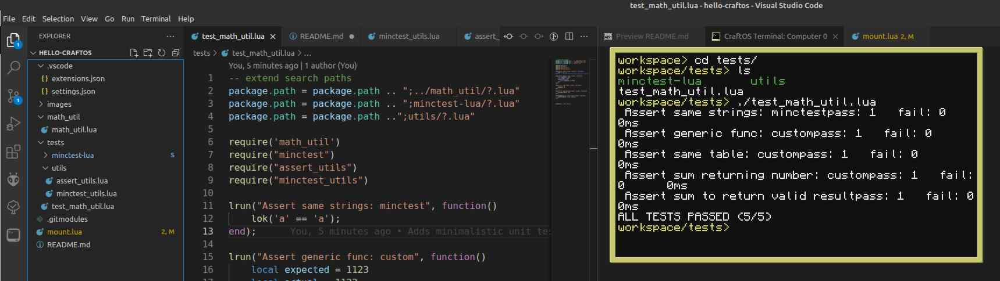
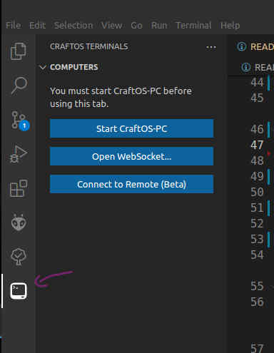
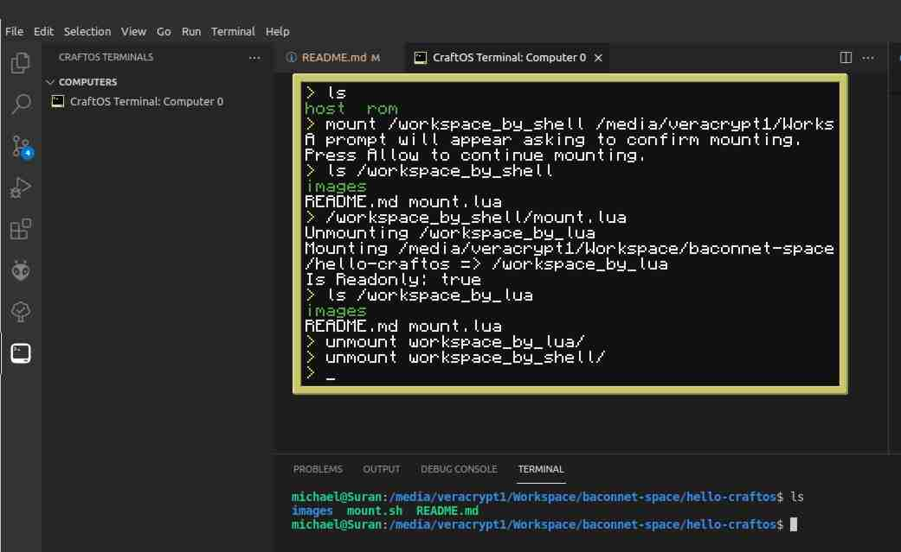
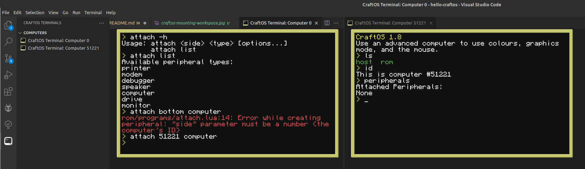

# Hello-CraftOS

Sets up a simple CraftOS project containing instructions on how to setup a dev env\
This project acts as a template for CraftOS projects.

## Cloning

This repository uses submodules so you will need to recursively clone all repositories.
```bash
git clone recursive https://gitlab.com/ohsnaparts/baconnet/hello-craftos.git
```


## Requirements

* **https://www.craftos-pc.cc/**
    * CraftOS [is a ComputerCraft / CC:Tweaked / CraftOS emulator](https://www.craftos-pc.cc/docs/about). It will add a new CLI/Desktop/Server tools  for running CraftOS on an emulated CC:Tweakedcomputer. With it we'll be able to develop using an IDE

> Theoretically, it should be possible to simplify installation by running raw mode docker containers while connecting to them using [CraftOS PC-Remote](https://www.craftos-pc.cc/docs/remote)


## Integrate with your tools

Opening the project with VSCode for the first time, it will ask you to install all recommended plugins. Otherwise see [extensions file](./.vscode/extensions.json) file in the [vscode](./.vscode) directory. Some settings have been preconfigured. See the settings file in the aforementioned vscode directory.


## Test and Deploy

For testing we arre using the very simple tool
* https://github.com/codeplea/minctest-lua
* https://codeplea.com/minctest

Minimalistic meeans, easy to maintain, simple to understand and portable due to few dependencies.

The [tests](./tests) directory conttains a functional example of a unit test.




> Someone has been kind and written a CraftOS specific unit testing layer or framework.\
> https://pastebin.com/P0B9gDYh


## Usage

1. **Open a new computer**
    * Use the tools located in the visual studio side bar\
      
1. **Mount your repository**
    * CraftOS uses "peripherals" to get access to the outer world. To grant it access to the repository, you'll have to [mount the directory as a disk](https://www.craftos-pc.cc/docs/mounter)\
    
    * For linux users, the / folder has been configured to mount automatically\
      See [workspace settings](./.vscode/settings.json)
1. **Attach peripherals**
   * To add additional computers attach them as peripherals\
   
   * Now you can either code using VSCode and execute scripts on CraftOS, or remount the workspace in rw-mode and edit them using\
   `edit ./script.lua`
1. **Have fun!**


## FAQ

* Why are some of the images so low quality?
  * Dialed up JPG compression to save valuable disk space someone else might need