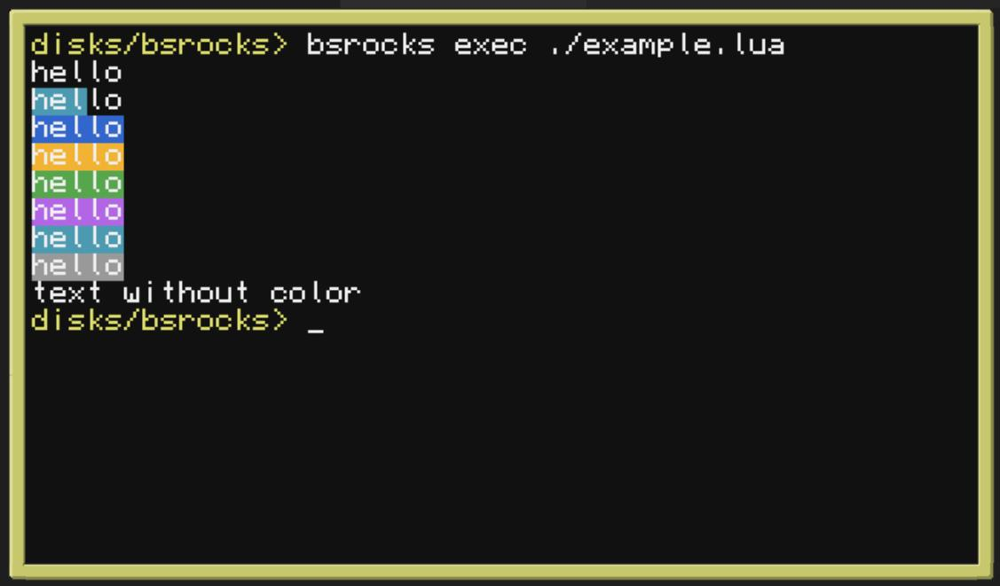

# BSRocks

Blue Shiny Rocks, or BSRocks for short serves two purposes:

Emulation of the Lua 5.1 environment
Lightweight implementation of LuaRocks

* https://github.com/SquidDev-CC/Blue-Shiny-Rocks

## How to use

Find and download a library to use. In our case we picked the ansicolors lib: <https://luarocks.org/modules/kikito/ansicolors>

```sh
bsrocks install ansicolors
bsrocks exec example.lua
```


