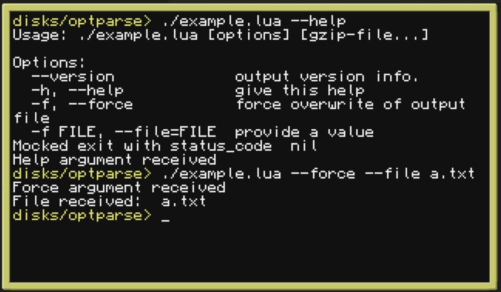

# Optparse

Lua-based partial reimplementation of Python's optparse command-line parsing module.

> Note: this implementation has been slightly altered to allow mocking of `exit` calls
> in environments that don't support it

## Usage

```sh
./example.lua --help
./example.lua --force --file a.txt
```



## Reference

* https://docs.python.org/3/library/optparse.html#the-store-action